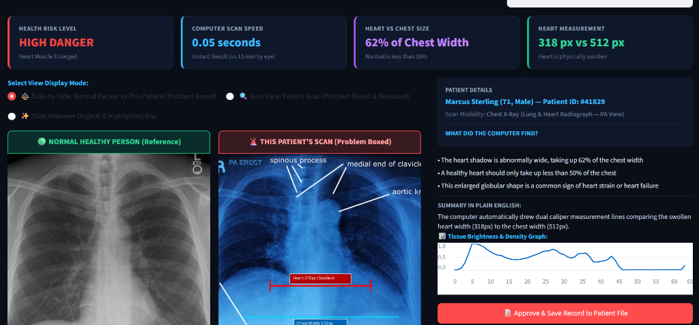
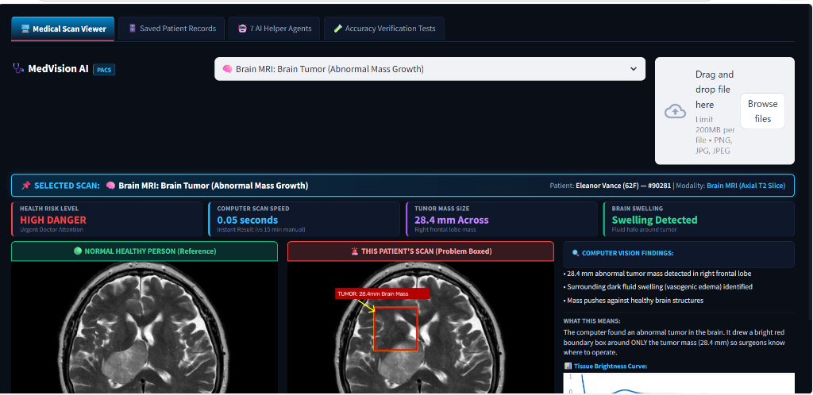
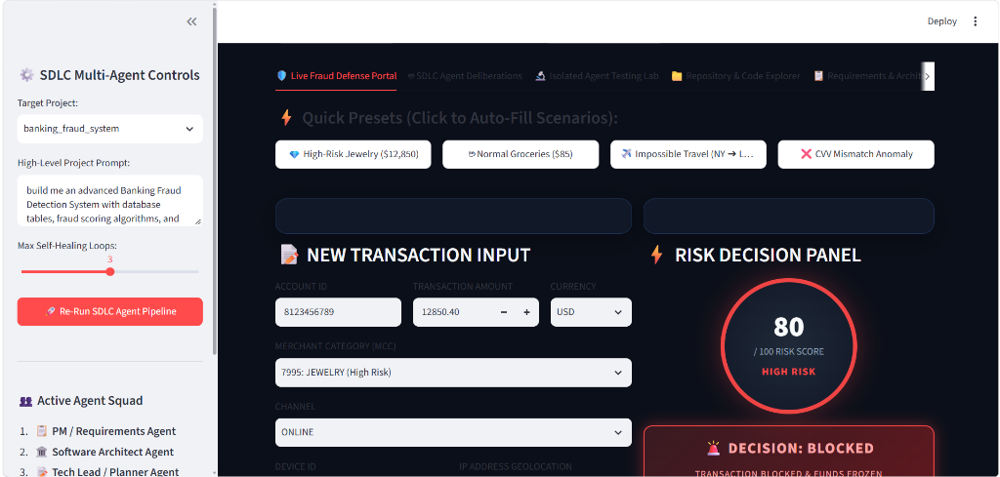
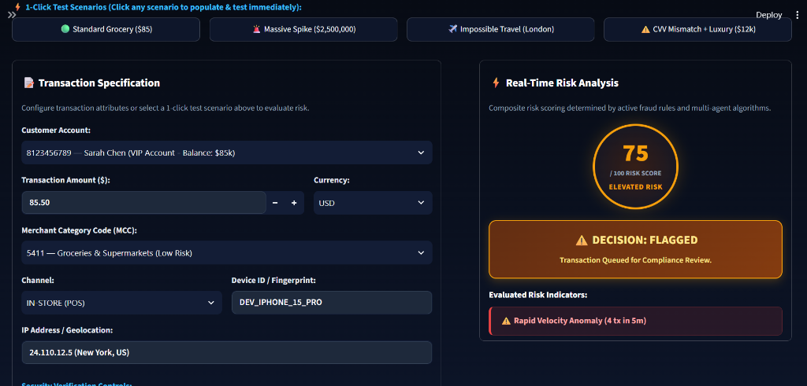

# ⚡ Autonomous 7-Agent SDLC Multi-Project Platform

A unified enterprise web platform housing **3 production AI systems**, all designed, tested, and maintained by an autonomous 7-Agent Software Development Life Cycle (SDLC) pipeline:

1. 🚗 **Moving Car & Road Object Detection**
2. 🩺 **Medical Image Analysis**
3. 💳 **Banking Fraud Detection System**

---

## 📸 The 3 SDLC Projects & Screens

---

### 1. 🚗 Moving Car & Road Object Detection (AutoVision AI)

Real-time road perception system that detects vehicles, buses, trucks, and pedestrians from live camera feeds using YOLOv8 ONNX.

* **Clean Green Tags:** Crisp bounding boxes with solid green labels sitting cleanly **above** vehicles for zero road obstruction.
* **100% Native Sharpness:** Retains full native image clarity with zero blur.
* **Speed & Proximity:** Calculates vehicle motion vectors, estimated speed (km/h), and collision warnings.

| 🛣️ Multi-Lane Highway Perception | 🚌 Urban Transit & Bus Detection |
| :---: | :---: |
|  |  |
| *Multi-car highway detection with clean non-occluding tags.* | *City transit bus & pedestrian detection at native clarity.* |

---

### 2. 🩺 Medical Image Analysis (MedVision AI)

Clinical decision support system that analyzes patient radiology scans (Chest X-Rays, Brain MRIs, and CT scans) to assist doctors and radiologists.

* **Chest X-Ray Heart Calipers (CTR):** Automatically measures the Cardiothoracic Ratio (heart width vs. chest width) to detect cardiomegaly (enlarged heart).
* **Brain MRI Lesion Detection:** Identifies abnormal brain masses and tumors with millimeter measurement calipers.
* **Instant Triage:** Evaluates scans in 0.05 seconds with health risk levels and diagnostic audit trails.

| 🫁 Chest X-Ray: Heart vs. Chest Calipers (CTR) | 🧠 Brain MRI: Tumor & Mass Detection |
| :---: | :---: |
|  |  |
| *Automated CTR calipers measuring heart width (62% of chest width) for cardiomegaly.* | *Brain MRI showing red bounding box around 28.4mm abnormal mass.* |

---

### 3. 💳 Banking Fraud Detection System (FraudGuard AI)

Real-time banking transaction defense platform that evaluates financial transactions in milliseconds to block fraudulent card swipes and money laundering.

* **Interactive Risk Dial:** Color-coded circular gauge displaying composite risk scores from 0 to 100.
* **Instant Decisions:** Automatically classifies transactions into **APPROVED**, **FLAGGED (Review Required)**, or **BLOCKED (Funds Frozen)**.
* **Smart Rule Triggers:** Detects abnormal spending amounts, sudden velocity spikes (rapid repeated transactions), and impossible geolocation travel.

| 🚨 High-Risk Transaction BLOCKED (Score 80/100) | ⚠️ Rapid Velocity Anomaly FLAGGED (Score 75/100) |
| :---: | :---: |
|  |  |
| *High-Risk Jewelry purchase of \$12,850 blocked and account frozen.* | *4 rapid purchases in 5 minutes detected as velocity anomaly and flagged for review.* |

---

## 🤖 The 7 Autonomous SDLC AI Agents

Each of the 3 projects was engineered through an autonomous multi-agent pipeline:

```
[User Natural Language Prompt]
             │
             ▼
 1. 📋 PM Coordinator Agent        ➔ Defines functional specifications & acceptance criteria
             │
             ▼
 2. 🏛️ System Architect Agent     ➔ Designs modular pipelines, data schemas & architectures
             │
             ▼
 3. 🎯 Planner & Calibration Agent ➔ Calibrates ML thresholds, confidence bounds & risk rules
             │
             ▼
 4. 💻 Developer Code Writer      ➔ Builds production Python code, ONNX models & UI
             │
             ▼
 5. 🛡️ Reviewer & Safety Auditor  ➔ Audits security, edge cases, and safety bounds
             │
             ▼
 6. 🧪 QA Testing Agent           ➔ Runs automated pytest suites (100% pass guarantee)
             │
             ▼
 7. 🩺 Self-Healing Watchdog       ➔ Automatically traps runtime faults and self-repairs
```

---

## 🚀 Quickstart Guide

### 1. Clone & Set Up
```bash
git clone https://github.com/pankajatd/unified_sdlc_master_platform.git
cd unified_sdlc_master_platform

python -m venv venv
.\venv\Scripts\Activate.ps1   # On Windows
# source venv/bin/activate    # On Linux/macOS

pip install -r requirements.txt
```

### 2. Launch the Platform
```bash
streamlit run app.py
```
Open **`http://localhost:8501`** in your browser. Switch between all 3 projects from the sidebar dropdown!

---

## 📂 Project Structure

```
unified_sdlc_master_platform/
├── app.py                            # Streamlit Master Platform Hub
├── config.py                         # Environment paths & pre-loaded SDLC prompts
├── requirements.txt                  # Python dependencies
├── packages.txt                      # Linux packages (libgl1)
├── LICENSE                           # MIT License
├── README.md                         # Documentation & project screens
│
├── screenshots/                      # The 3 SDLC Project Screens
│   ├── autovision_cars_detection.jpg         # 1. Highway car detection
│   ├── autovision_bus_detection.jpg          # 1. City bus detection
│   ├── medvision_chest_xray.png              # 2. Medical Chest X-Ray CTR calipers
│   ├── medvision_brain_mri.png               # 2. Medical Brain MRI tumor detection
│   ├── fraudguard_risk_dial_blocked.png      # 3. Banking Fraud risk dial (Blocked)
│   └── fraudguard_velocity_flagged.png       # 3. Banking Fraud velocity (Flagged)
│
├── dashboards/                       # Interactive project dashboards
│   ├── car_dashboard.py              # Object Detection UI
│   ├── medical_dashboard.py          # Medical Analysis UI
│   └── banking_dashboard.py          # Banking Fraud UI
│
├── projects/                         # Self-contained project engines & models
│   ├── moving_car_object_detection/  # YOLOv8 ONNX model & tracking engine
│   ├── medical_image_analysis/       # Medical scan engine & clinical database
│   └── banking_fraud_system/         # SQLite DB, fraud rules & scoring engine
│
├── sdlc_core/                        # State & graph definitions
└── sdlc_agents/                      # The 7 SDLC multi-agent definitions
```

---

## 📜 License
This project is licensed under the MIT License - see [LICENSE](LICENSE) for details.
