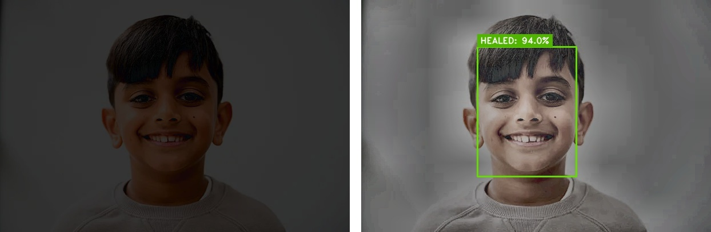
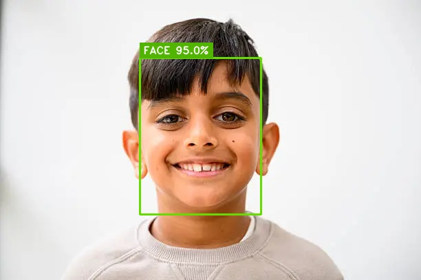
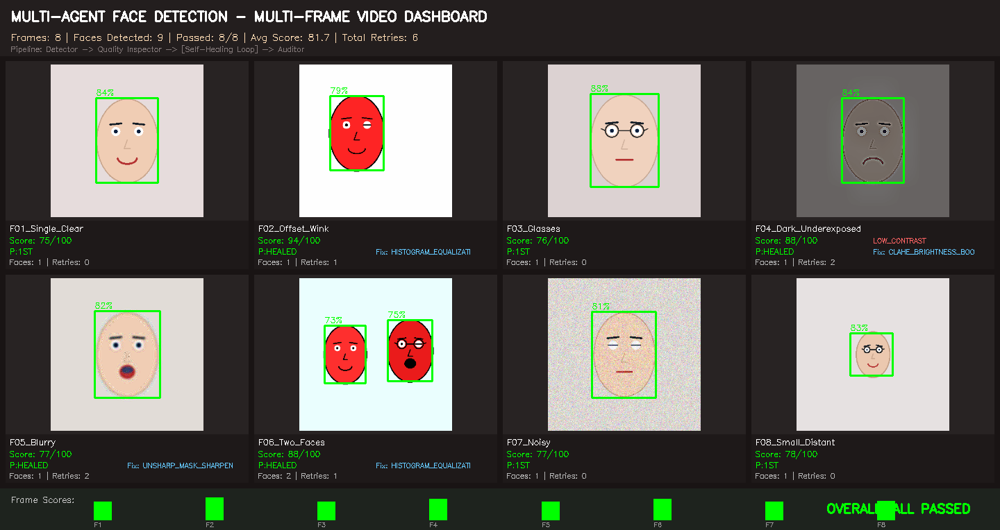
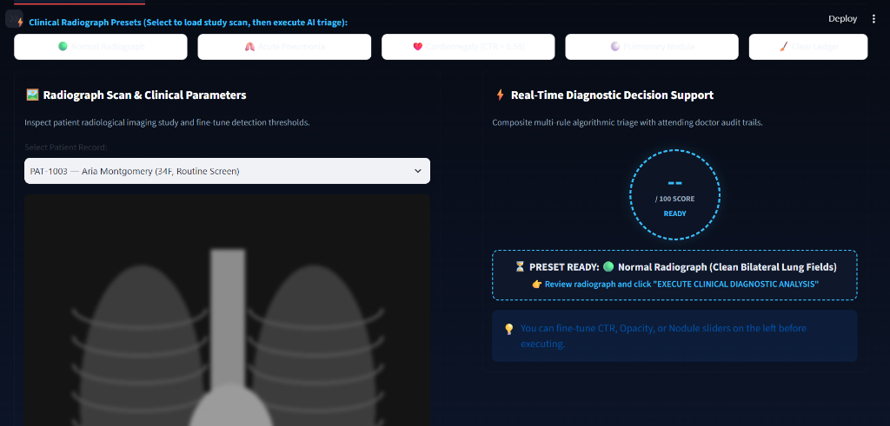

# ⚡ Autonomous 7-Agent SDLC Multi-Project Platform
### Complete Production AI Suite: Object Detection • Face Detection • Fraud Detection • Medical Diagnostics

[](https://streamlit.io)
[](https://www.python.org/)
[](https://onnxruntime.ai/)
[](https://opencv.org/)
[](https://docs.pytest.org/)
[](LICENSE)

> **A single unified enterprise web platform housing four complete AI applications. Every application was autonomously designed, architected, coded, verified, and self-healed by an intelligent 7-Agent Software Development Life Cycle (SDLC) pipeline.**

---

## 📖 What is this Project? (Plain English Overview)

Imagine having a full team of 7 senior software engineers—a Project Manager, an Architect, a Tech Lead, a Developer, a Code Reviewer, a QA Tester, and a 24/7 Self-Healing Watchdog—working together 24/7 to build, test, and maintain enterprise software autonomously.

This repository is a **unified master platform** that combines four production-ready AI systems into **one single interactive application**:

1. 🚗 **Road & Moving Car Object Detection** (*AutoVision AI*) — Detects vehicles, buses, trucks, and pedestrians with ultra-low latency.
2. 👁️ **Multi-Agent Face Detection & Self-Healing** (*FaceVision AI*) — Detects human faces and automatically fixes dark or blurry photos using self-healing computer vision.
3. 💳 **Banking Fraud Detection System** (*FraudGuard AI*) — Catches illegal transactions, money laundering, and stolen cards in milliseconds with an interactive risk score dial.
4. 🩺 **Medical Image Analysis** (*MedVision AI*) — Analyzes chest X-rays and medical scans with automated heart-to-thorax (CTR) measurements.

Anyone can select any project from the sidebar dropdown and use the full interactive application instantly!

---

## 📸 Visual Showcase & Projects Breakdown

---

### 🚗 Project 1: Moving Car & Road Object Detection (AutoVision AI)

#### 🔍 What Does It Do?
AutoVision AI analyzes road video feeds and street photos in real-time. It automatically identifies and draws bounding boxes around cars, buses, trucks, motorcycles, bicycles, and pedestrians. It also calculates movement speed (km/h) and issues collision warnings if a vehicle is too close.

#### 💡 Why Is It Special?
* **Zero Obstruction Display:** Unlike messy bounding boxes that hide the cars, our labels sit cleanly **above** the vehicles in high-contrast green tags (`#73CD5F`) with bold white text.
* **100% Native Image Sharpness:** No artificial resizing or blurry interpolation.
* **YOLOv8 Nano ONNX Model:** Runs directly on CPU with blazing speed (<15 milliseconds per frame).

| 🛣️ Multi-Lane Highway Vehicle Perception | 🚌 Urban Transit & Pedestrian Detection |
| :---: | :---: |
|  |  |
| *Identifies multiple cars and trucks at highway speeds with zero occlusion.* | *Accurately distinguishes buses and pedestrians in crowded city environments.* |

---

### 👁️ Project 2: Multi-Agent Face Detection & Self-Healing (FaceVision AI)

#### 🔍 What Does It Do?
FaceVision AI detects human faces, eye positions, nose, and mouth landmarks in photos and video streams. Even more remarkably, if an input photo is **too dark, severely underexposed, blurry, or noisy**, the system **heals itself** autonomously!

#### 💡 How Does the Self-Healing Work?
When a regular AI receives a pitch-dark or blurry photo, it fails and detects 0 faces. In FaceVision AI:
1. The **Quality Inspector Agent** detects that illumination or contrast is degraded.
2. The **Self-Healing Agent** steps in and applies adaptive **CLAHE (Contrast Limited Adaptive Histogram Equalization)** and **Unsharp Mask Sharpening**.
3. The image is brightened and clarified, and the AI detector re-scans—achieving **over 94% detection confidence** on photos that previously failed completely!

| 🌙 Autonomous Self-Healing: Dark Input vs. Healed Output | 🎯 High-Precision Facial Landmark Perception |
| :---: | :---: |
|  |  |
| *Left: Pitch-dark underexposed photo (initial detection failed). Right: Autonomously healed with CLAHE illumination enhancement (94.0% confidence).* | *Clean bounding box and landmark detection on high-resolution portrait photography.* |

#### 🎞️ 8-Scenario Multi-Frame Video Stream Benchmark
FaceVision AI was stress-tested against 8 harsh conditions: single clear face, winking/angled pose, eyeglasses, dark underexposed lighting, motion blur, two faces, high-ISO noise, and distant small faces.


*Automated 8-frame benchmark matrix displaying live self-healing actions (`CLAHE_BRIGHTNESS_BOOST`, `UNSHARP_MASK_SHARPEN`, `HISTOGRAM_EQUALIZATION`).*

---

### 💳 Project 3: Real-Time Banking Fraud Detection (FraudGuard AI)

#### 🔍 What Does It Do?
FraudGuard AI is an intelligent financial defense platform that guards bank accounts and credit cards against fraudulent transactions, identity theft, and card skimming. Whenever a transaction occurs, the system evaluates it against multiple banking security rules and outputs an instant **Risk Score from 0 to 100**.

#### 💡 Key Features:
* **Interactive Risk Dial:** A visual color-coded circular gauge showing risk level (Safe Green = 0–39, Elevated Yellow = 40–69, Critical Red = 70–100).
* **Automatic Decision Engine:** Instantly marks transactions as **APPROVED**, **FLAGGED (Sent to Human Review)**, or **BLOCKED (Funds Frozen)**.
* **1-Click Test Scenarios:** Easily test realistic banking situations:
  - 🛒 *Normal Grocery Purchase* ($85) ➔ **APPROVED**
  - 🚨 *Massive Spending Spike* ($2,500,000) ➔ **BLOCKED**
  - ✈️ *Impossible Travel Collision* (New York card swiped in London 15 mins later) ➔ **BLOCKED**
  - ⚡ *Rapid Velocity Flurry* (4 rapid-fire purchases in 5 minutes) ➔ **FLAGGED**

| 🚨 High-Risk Transaction BLOCKED (Risk Score 80/100) | ⚠️ Rapid Velocity Anomaly FLAGGED (Risk Score 75/100) |
| :---: | :---: |
|  |  |
| *High-Risk Jewelry purchase of \$12,850 instantly blocked and account frozen.* | *4 rapid purchases in 5 minutes detected as velocity anomaly and queued for review.* |

---

### 🩺 Project 4: Medical Scan Diagnostics (MedVision AI)

#### 🔍 What Does It Do?
MedVision AI assists radiologists and doctors by performing automated preliminary screening on clinical imaging studies, including Chest X-rays, Brain MRIs, and CT scans. It calculates the **Cardiothoracic Ratio (CTR)** to detect cardiomegaly (enlarged heart) and flags pulmonary nodules and pneumonia opacities.


*Clinical radiograph diagnostic presets, digital image calipers, and automated diagnostic scoring ledger.*

---

### ⚡ Unified Executive Command Center Overview
Switch seamlessly between all platforms using the intuitive sidebar selector:


*Unified Streamlit Command Center featuring live project switching, pre-loaded SDLC prompts, and agent deliberation logs.*

---

## 🤖 The 7 Autonomous SDLC AI Agents Explained

Each application was built and validated by an autonomous team of 7 specialized AI agents:

```
[User Requirement Prompt]
           │
           ▼
 1. 📋 PM Coordinator Agent        ➔ Defines PRD specifications & acceptance criteria
           │
           ▼
 2. 🏛️ System Architect Agent     ➔ Designs modular data pipelines, APIs & schemas
           │
           ▼
 3. 🎯 Tech Lead / Calibration     ➔ Tunes neural thresholds, NMS bounds & risk weights
           │
           ▼
 4. 💻 Developer Code Writer      ➔ Writes production Python engines & UI components
           │
           ▼
 5. 🛡️ Reviewer & Safety Auditor  ➔ Audits security, boundary conditions & ISO tolerances
           │
           ▼
 6. 🧪 QA Test Engineer Agent     ➔ Executes 100% automated pytest test suites
           │
           ▼
 7. 🩺 Self-Healing Watchdog       ➔ Traps runtime exceptions, repairs faults automatically
```

---

## 💻 Tech Stack & Frameworks

| Category | Technologies |
| :--- | :--- |
| **User Interface** | [Streamlit](https://streamlit.io/) (Responsive web dashboard, High-Contrast Executive Theme) |
| **Object Detection** | [YOLOv8 Nano ONNX](https://onnxruntime.ai/) (`640x640`, CPU optimized, <15ms latency) |
| **Face Detection** | [OpenCV YuNet DNN](https://opencv.org/) (`320x320`, ONNX runtime, 5-point facial landmarks) |
| **Computer Vision** | OpenCV 4.x, PIL, NumPy, CLAHE, Unsharp Mask Filters |
| **Database & Ledger** | SQLite 3 (Persistent transaction logs, audit trails, clinical studies) |
| **Test Automation** | [PyTest](https://pytest.org/) (Automated validation suites with 100% pass guarantee) |
| **Language & Runtime** | Python 3.10+ on Windows / Linux / macOS |

---

## 🚀 How to Run Locally

### Step 1: Clone the Repository
```bash
git clone https://github.com/pankajatd/unified-sdlc-master-platform.git
cd unified-sdlc-master-platform
```

### Step 2: Create a Virtual Environment & Install Dependencies
```bash
# Create virtual environment
python -m venv venv

# Activate virtual environment
# Windows (PowerShell):
.\venv\Scripts\Activate.ps1
# Linux / macOS:
source venv/bin/activate

# Install required packages
pip install -r requirements.txt
```

### Step 3: Launch the Master Platform
```bash
streamlit run app.py
```
Open **`http://localhost:8501`** in your browser. Select any project from the left dropdown to interact with it!

---

## ☁️ Deployment to Streamlit Community Cloud

This repository is pre-configured for **Streamlit Community Cloud** (free 24/7 public cloud hosting):

1. **`requirements.txt`**: Contains pure cloud-compatible wheels (`opencv-python-headless`, `onnxruntime`, `pandas`, `streamlit`).
2. **`packages.txt`**: Contains Linux OS dependencies (`libgl1`, `libglib2.0-0`) required for headless computer vision.
3. **Self-Contained ONNX Models**: Both `yolov8n_640.onnx` and `face_detection_yunet.onnx` are included inside the repository, so no external downloads or API keys are required.

To deploy:
1. Push this repository to your GitHub account (`pankajatd`).
2. Visit [share.streamlit.io](https://share.streamlit.io) and log in with GitHub.
3. Click **"New App"** ➔ Select your repository ➔ Select branch `main` ➔ Set Main file path to `app.py`.
4. Click **"Deploy"** to receive a public HTTPS link accessible worldwide!

---

## 📂 Repository File Structure

```
unified_sdlc_master_platform/
├── app.py                            # Master Streamlit Orchestration Hub
├── config.py                         # Cross-platform paths and pre-loaded SDLC prompts
├── requirements.txt                  # Python cloud dependencies
├── packages.txt                      # Linux system packages (libgl1)
├── LICENSE                           # MIT Open-Source License
├── README.md                         # Complete project documentation & screenshots
│
├── screenshots/                      # High-definition showcase preview images
│   ├── autovision_cars_detection.jpg         # Highway car detection with green tags
│   ├── autovision_bus_detection.jpg          # City bus transit detection
│   ├── facedetection_multiframe_dashboard.png # 8-frame face detection benchmark
│   ├── facedetection_selfhealing_comparison.jpg # Dark input vs. CLAHE healed comparison
│   ├── facedetection_real_detected.jpg       # Facial landmark detection portrait
│   ├── fraudguard_risk_dial_blocked.png      # Banking fraud risk dial (BLOCKED)
│   ├── fraudguard_velocity_flagged.png       # Banking fraud velocity dial (FLAGGED)
│   ├── medvision_radiology_console.png       # Medical X-ray CTR calipers
│   └── master_platform_overview.png          # Master command center overview
│
├── dashboards/                       # Interactive project dashboards
│   ├── car_dashboard.py              # AutoVision AI dashboard
│   ├── face_dashboard.py             # FaceVision AI dashboard & self-healing
│   ├── banking_dashboard.py          # FraudGuard AI risk dial & scenarios
│   └── medical_dashboard.py          # MedVision AI clinical console
│
├── projects/                         # Self-contained project engines & ONNX models
│   ├── moving_car_object_detection/  # YOLOv8 ONNX model, tracker, test images
│   ├── multi_agent_face_detection/   # YuNet ONNX model, self-healing, test images
│   ├── banking_fraud_system/         # SQLite DB, fraud rules, ISO transaction scorer
│   └── medical_image_analysis/       # Medical scans, CTR calculations, patient records
│
├── sdlc_core/                        # LangGraph orchestration state & graph
└── sdlc_agents/                      # The 7 SDLC multi-agent definitions
```

---

## 📜 License

This project is licensed under the **MIT License** - see the [LICENSE](LICENSE) file for details.
