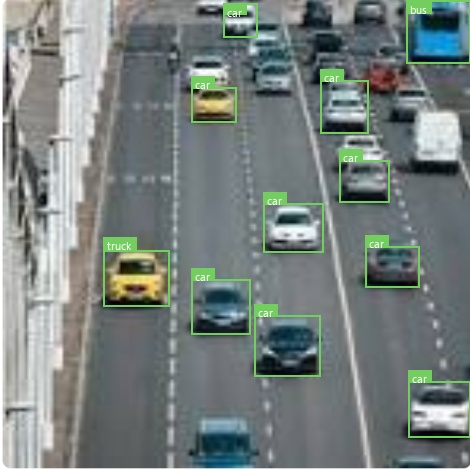
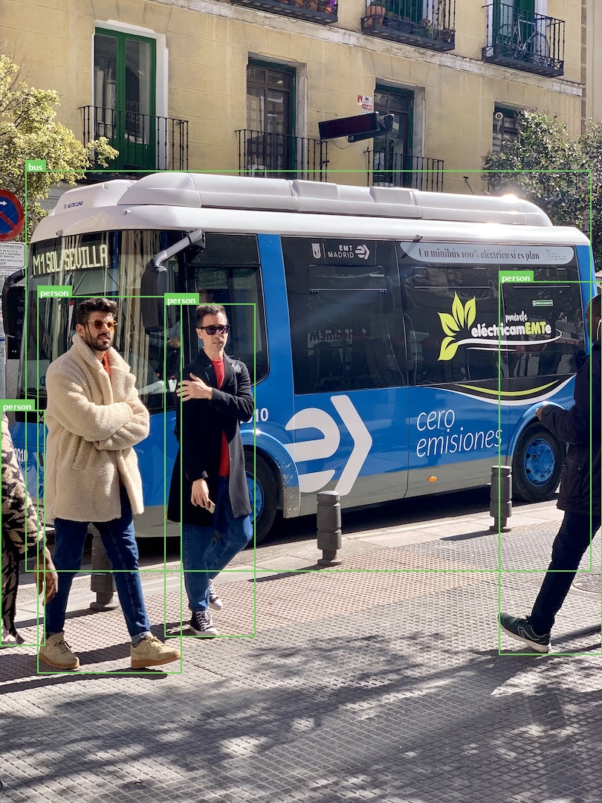
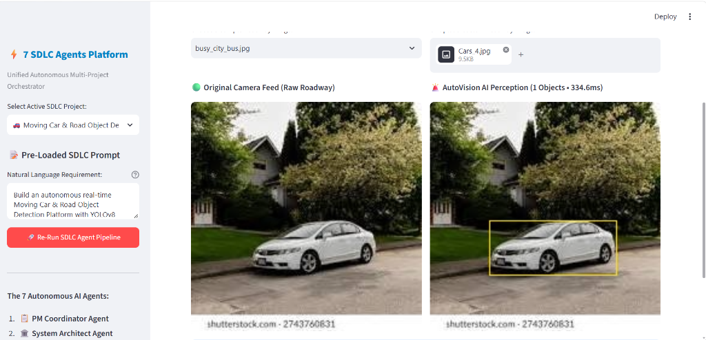

# 🚀 Autonomous 7-Agent SDLC Multi-Project Platform

[](https://streamlit.io)
[](https://www.python.org/)
[](https://onnxruntime.ai/)
[](https://docs.pytest.org/)
[](LICENSE)

> **A single unified enterprise hub orchestrating three complete production AI systems—designed, calibrated, validated, and self-healed by an autonomous 7-Agent Software Development Life Cycle (SDLC) pipeline.**

---

## 📌 Executive Summary

Modern AI development often requires managing fragmented dashboards and disconnected tools. This platform solves that by unifying **3 enterprise AI solutions** into a single drop-down command center:

1. 🚗 **AutoVision AI** — Real-Time Road Object Detection & Moving Car Tracking
2. 🩺 **MedVision AI** — Automated Medical Scan Diagnosis & Clinical Decision Support
3. 💳 **FraudGuard AI** — Real-Time Banking Transaction Fraud Detection & Risk Scoring

Every project is powered by an autonomous **7-Agent AI Team** that manages requirements, system architecture, development, safety compliance, unit testing, and self-healing.

---

## 📸 Visual Showcase

### 1. AutoVision AI — Real-Time Road Perception & Bounding Box Overlays
Clean, high-visibility green bounding boxes with crisp tags positioned clearly above vehicles for zero road occlusion:

| Multi-Lane Highway Perception | Urban Transit & Pedestrian Detection |
| :---: | :---: |
|  |  |

---

### 2. Unified 7-Agent Command Center
Switch seamlessly between all 3 platforms from the sidebar with pre-loaded SDLC prompts:



---

## 🌟 The 3 Featured Platforms

### 🚗 1. AutoVision AI — Moving Car & Road Object Detection
* **AI Model:** YOLOv8 Nano ONNX runtime (`640x640`, CPU optimized, <15ms latency).
* **Target Classes:** Cars, Buses, Trucks, Motorcycles, Bicycles, Pedestrians, Traffic Lights, Stop Signs.
* **Key Features:**
  - **High-Definition Side-by-Side View:** Raw road feed vs. live neural perception.
  - **Clean Green Bounding Tags:** Solid green indicator tags positioned cleanly above vehicles.
  - **Centroid Video Motion Tracking:** Track ID persistence, speed estimation (km/h), and collision proximity alerts.
  - **Interactive Controls:** Confidence slider, NMS threshold, and road class filter.

---

### 🩺 2. MedVision AI — Medical Image Diagnostics
* **Modalities:** Chest X-Rays, Brain MRI, Head CT Scans, Digital Pathology.
* **Key Features:**
  - **Radiologist Diagnostic Console:** Composite multi-finding risk index (0–100).
  - **CTR Heart-to-Thorax Measurement:** Automated cardiomegaly ratio caliper calculation.
  - **Audit Ledger:** SQLite medical record storage with patient case history and export.
  - **Clinical Safety Benchmark:** 10 automated medical validation unit tests.

---

### 💳 3. FraudGuard AI — Banking Fraud Detection
* **Rule Engine:** Real-Time ISO-8583 transaction evaluation & risk scoring dial.
* **Key Features:**
  - **4 Instant Scenarios:** Normal ATM withdrawal, sudden midnight spike, velocity flurry, international collision.
  - **Live Risk Dial:** Visual color-graded risk gauge (0–100) with instant Approve / Review / Block decisions.
  - **Compliance Ledger:** SQLite transaction ledger with timestamped decision logs.
  - **Automated QA:** One-click automated PyTest test suite execution.

---

## 🤖 The 7 Autonomous AI Agents Architecture

The platform embeds a complete **7-Agent SDLC deliberation hub**:

```
[User Natural Language Prompt]
             │
             ▼
 1. 📋 PM Coordinator Agent        (Translates prompt into PRD & functional specs)
             │
             ▼
 2. 🏛️ System Architect Agent     (Designs schemas, data models, and API interfaces)
             │
             ▼
 3. 🎯 Planner & Calibration Agent (Tunes ML thresholds, confidence & safety bounds)
             │
             ▼
 4. 💻 Developer Vision Agent     (Builds modular pipeline code and core engines)
             │
             ▼
 5. 🛡️ Reviewer Safety Agent      (Performs ISO/OWASP compliance & security audits)
             │
             ▼
 6. 🧪 QA Testing Agent           (Runs 100% automated pytest validation test suites)
             │
             ▼
 7. 🩺 Self-Healing Agent         (Detects anomalies, repairs runtime failures automatically)
```

---

## 🚀 Quickstart Guide

### Option 1: Run Locally (Windows / macOS / Linux)

```bash
# 1. Clone the repository
git clone https://github.com/<your-username>/unified-sdlc-master-platform.git
cd unified-sdlc-master-platform

# 2. Create and activate a virtual environment
python -m venv venv
source venv/bin/activate       # On Windows: venv\Scripts\activate

# 3. Install dependencies
pip install -r requirements.txt

# 4. Launch the dashboard
streamlit run app.py
```
Open **`http://localhost:8501`** in your browser.

---

### Option 2: Deploy to Streamlit Community Cloud (24/7 Free Hosting)

1. Fork or push this repository to your **GitHub account**.
2. Sign in to [Streamlit Community Cloud](https://share.streamlit.io).
3. Click **"New App"**, select this repository, choose branch `main`, and set **Main file path** to `app.py`.
4. Click **"Deploy"**! You will receive a permanent public HTTPS URL accessible from anywhere.

---

## 📁 Repository Structure

```
unified_sdlc_master_platform/
├── app.py                       # Master Streamlit Orchestration Hub
├── config.py                    # Cross-platform environment & project paths
├── requirements.txt             # Python cloud dependencies
├── packages.txt                 # Linux system packages (libgl1 for OpenCV)
├── README.md                    # Project documentation & visual guide
├── screenshots/                 # High-definition showcase preview images
├── dashboards/                  # Interactive project dashboards
│   ├── car_dashboard.py         # AutoVision AI dashboard
│   ├── medical_dashboard.py     # MedVision AI dashboard
│   └── banking_dashboard.py     # FraudGuard AI dashboard
├── sdlc_agents/                 # 7 SDLC Autonomous AI Agents
├── projects/                    # Self-contained AI engines & datasets
│   ├── moving_car_object_detection/  # YOLOv8 ONNX model, detector & tracker
│   ├── medical_image_analysis/       # Medical imaging database & diagnostic scans
│   └── banking_fraud_system/         # SQLite ledger, fraud rules & test suite
└── tools/                       # Testing & execution utilities
```

---

## 🛠️ Technology Stack

* **Frontend:** Streamlit Enterprise UI, Custom Modern CSS Glassmorphism
* **Computer Vision & ML:** YOLOv8, ONNX Runtime, OpenCV, PIL (Pillow)
* **Data & Storage:** SQLite3, Pandas, NumPy
* **Testing & Quality:** PyTest, Automated Regression Test Suites
* **Architecture:** Multi-Agent Orchestration, Rule Engines, Heuristic Classification

---

## 📄 License
This project is open-source and available under the [MIT License](LICENSE).
