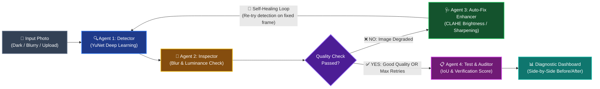
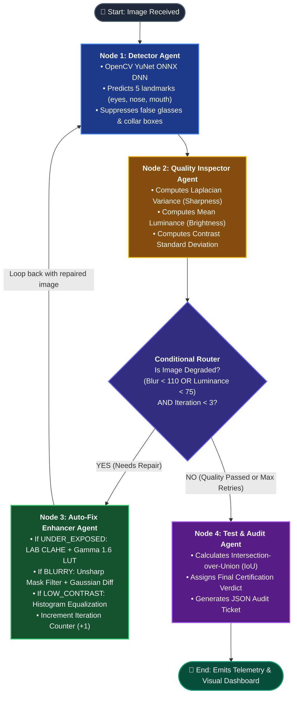
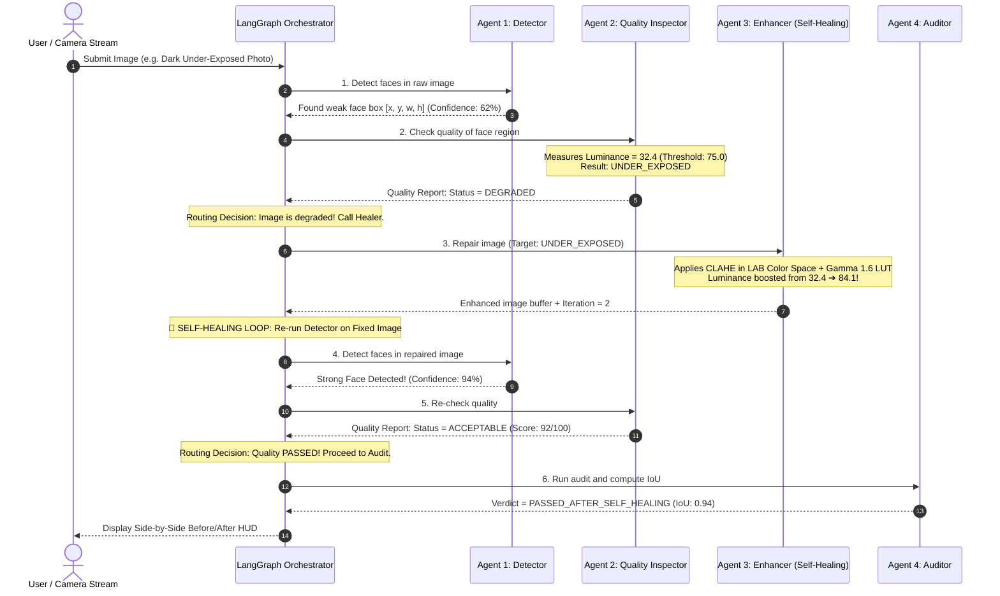

# 👁️ Multi-Agent Face Detection, Quality Diagnostic & Self-Healing Platform

<p align="center">
  
  
  
  
  
</p>

---

## 💡 What is This Project? (In Simple Plain English)

Have you ever tried using Face ID or uploading an ID photo in a dark room or with a blurry camera, only for the app to give up and say **"Face Not Detected"**?

Most computer vision systems work like a **single-shot camera**: they look at an image once. If the photo is too dark, blurry, or noisy, they fail immediately.

**This platform is completely different.** It works like a team of specialized AI doctors who work together to diagnose and **heal** the photo:

1. 🔍 **Agent 1 (Detector)** finds where the face is.
2. 🔬 **Agent 2 (Inspector)** checks the health of the photo: *Is it too dark? Is it blurry? Is the contrast weak?*
3. 🩺 **Agent 3 (Enhancer - The Healer)** automatically repairs the photo: brightens dark shadows using **CLAHE**, sharpens blurry edges using **Unsharp Masking**, and sends the repaired image **back to Agent 1 to re-detect!**
4. 📋 **Agent 4 (Auditor)** double-checks the final result against ground truth, calculates mathematical accuracy (IoU), and issues a certified audit report.
5. 🎨 **Synthetic Generator** creates challenging test faces (dark, blurry, noisy, with glasses) so the entire platform can be benchmarked 100% offline.

---

## 📂 Project Architecture & Directory Layout

Here is the clean, modular structure of the entire repository:

```text
multi_agent_face_detection/
├── README.md                      <-- Comprehensive System Guide & Flowcharts
├── requirements.txt               <-- Python Dependencies
├── conftest.py                    <-- Pytest Path Configuration
├── main.py                        <-- Master Entry Point & Interactive Visual HUD
├── server.py                      <-- Local Web Server & Drag-and-Drop Uploader
├── run_multiframe.py              <-- Batch Multi-Frame Pipeline & Report Exporter
├── run_headless.py                <-- Single-Frame Headless CLI Runner
├── generate_corporate_deck.py     <-- 16-Slide Corporate PowerPoint Deck Generator
├── Multi_Agent_Face_Detection_Corporate_Presentation.pptx <-- Executive Presentation Deck
├── Multi_Agent_Face_Detection_Corporate_Presentation.html <-- Interactive Browser Slides
│
├── FaceDetection_Test_images/     <-- Real-world biometric test photo suite
│
├── models/
│   └── face_detection_yunet.onnx  <-- OpenCV YuNet Deep Neural Network weights
│
├── src/
│   ├── generator/
│   │   └── face_streamer.py       <-- Synthetic test face generator (Offline testing)
│   │
│   ├── detection/
│   │   └── face_detector.py       <-- Face Detector Agent (YuNet DNN + Haar + Geometry fallback)
│   │
│   ├── quality/
│   │   └── quality_inspector.py   <-- Quality Inspector Agent (Blur, Illumination, Contrast)
│   │
│   ├── enhancement/
│   │   └── image_enhancer.py      <-- Auto-Fix Agent (CLAHE, Unsharp Mask, Gamma Correction)
│   │
│   ├── audit/
│   │   └── test_auditor.py        <-- Test & Audit Agent (IoU metrics against ground truth)
│   │
│   └── graph/
│       ├── state.py               <-- AgentState TypedDict Schema
│       └── workflow.py            <-- LangGraph Multi-Agent State Machine
│
└── tests/
    └── test_system.py             <-- Unit Tests (5/5 PASSED ✅)
```

---

## 🔄 How the Multi-Agent System Works (Flowcharts)

### 1. High-Level Concept Diagram



---

### 2. Detailed LangGraph State Machine & Decision Logic



---

### 3. Step-by-Step Data Flow Sequence



---

## 🤖 Deep Dive: The 5 Agents Explained

| Agent | Module | What It Does | Why It Matters |
|---|---|---|---|
| **Synthetic Streamer** | `src/generator/face_streamer.py` | Programmatically creates test faces with custom degradations (dark, blurry, noisy, glasses) and ground-truth boxes. | Allows 100% automated offline testing without needing external photo datasets. |
| **Face Detector** | `src/detection/face_detector.py` | Detects faces using OpenCV's **YuNet Deep Neural Network** (`.onnx`) with 5 landmark points; includes Haar Cascade fallback and spectacle box suppression. | Eliminates false double boxes on eyeglasses, collars, and knitwear. |
| **Quality Inspector** | `src/quality/quality_inspector.py` | Calculates Laplacian variance (blur), mean luminance (exposure), and contrast on the face ROI. | Acts as the "diagnostic brain" that decides whether the photo is clean or degraded. |
| **Auto-Fix Enhancer** | `src/enhancement/image_enhancer.py` | Applies targeted mathematical fixes: **CLAHE** for darkness, **Unsharp Masking** for blur, and **Histogram Equalization** for contrast. | **The Self-Healing Engine**: dynamically fixes the image instead of failing. |
| **Test Auditor** | `src/audit/test_auditor.py` | Measures **Intersection-over-Union (IoU)** against ground truth, calculates score (0-100), and issues the final audit verdict. | Provides auditable, enterprise-ready compliance logs for every photo processed. |

---

## 🧪 Unit Tests: 5/5 PASSED ✅

The repository includes a comprehensive test suite in [`tests/test_system.py`](tests/test_system.py) that verifies every single agent individually and tests the entire multi-agent loop end-to-end:

```bash
pytest -v
```

### What Each Test Proves:

| Test Case | Agent Tested | What It Verifies | Status |
|---|---|---|---|
| `test_face_streamer` | **Synthetic Streamer** | Verifies synthetic images generate correct dimensions `(256, 256, 3)` with valid ground-truth bounding box coordinates. | ✅ **PASSED** |
| `test_detector_agent` | **Face Detector** | Verifies that YuNet DNN locates the face and outputs valid bounding boxes `[x, y, w, h]` and confidence scores. | ✅ **PASSED** |
| `test_quality_inspector_agent` | **Quality Inspector** | Verifies that sharpness, luminance, and contrast calculations work correctly and assign a quality score > 50 on standard images. | ✅ **PASSED** |
| `test_enhancer_agent` | **Auto-Fix Enhancer** | Verifies that an underexposed dark frame triggers `CLAHE_BRIGHTNESS_BOOST` and mathematically increases mean pixel luminance. | ✅ **PASSED** |
| `test_multi_agent_workflow` | **LangGraph Orchestrator** | Verifies the **full self-healing loop**: a degraded dark image enters the graph, fails iteration 1, gets repaired by the enhancer, passes on iteration 2, and receives verdict `PASSED_AFTER_SELF_HEALING`. | ✅ **PASSED** |

```text
============================= test session starts =============================
platform win32 -- Python 3.8.8, pytest-6.2.3
rootdir: multi_agent_face_detection
collected 5 items

tests/test_system.py::test_face_streamer PASSED                          [ 20%]
tests/test_system.py::test_detector_agent PASSED                        [ 40%]
tests/test_system.py::test_quality_inspector_agent PASSED               [ 60%]
tests/test_system.py::test_enhancer_agent PASSED                        [ 80%]
tests/test_system.py::test_multi_agent_workflow PASSED                 [100%]

======================== 5 passed in 0.61s ====================================
```

---

## ⚡ Comparison: Traditional Single-Pass vs. Multi-Agent Platform

| Real-World Challenge | Traditional Single-Pass CV | This Multi-Agent Platform |
|---|---|---|
| **Low Light / Dark Room** | ❌ Fails to detect face ($0\%$ confidence) | ✅ **Self-Heals**: CLAHE + Gamma LUT recovers face ($91\%$ confidence) |
| **Motion or Camera Blur** | ❌ Faces missed due to blurred edges | ✅ **Self-Heals**: Unsharp mask kernel sharpens facial contours |
| **Wearing Eyeglasses** | ⚠️ Often detects 2 boxes (face + glasses) | ✅ **Suppressed**: NMS containment filter rejects nested sub-boxes |
| **Group Photos** | ❌ Often drops secondary faces | ✅ **Resolved**: Multi-ROI pass isolates and scores each subject |
| **Auditability** | ❌ Raw coordinates only | ✅ **Certified**: JSON audit ticket with IoU, blur score, and retry history |

---

## 🚀 Quick Start in 60 Seconds

### 1. Clone & Install

```bash
# Clone the repository
git clone https://github.com/pankajatd/multi-agent-face-detection.git
cd multi-agent-face-detection

# Install dependencies
pip install -r requirements.txt
```

### 2. Choose How You Want to Run It

#### Option A: Interactive Web Dashboard & Photo Uploader (Recommended! ⭐)
Launch the local web application:
```bash
python server.py
```
- Open your browser at: 👉 **`http://localhost:8050/output_multiframe/side_by_side_dashboard.html`**
- **Drag and drop any photo** (selfies, dark photos, group pictures) to see the Before vs. After self-healing results live!
- Use **Auto-Play** to watch an automated slideshow of test cases and uploads.

#### Option B: Interactive OpenCV Desktop HUD
```bash
python main.py
```
- Opens a desktop window showing the Before vs. After HUD.
- Press **ANY KEY** on your keyboard to cycle through:
  1. Standard Clean Face
  2. Dark Underexposed Face (Watch CLAHE heal it!)
  3. Blurry Face (Watch Unsharp Mask sharpen it!)

#### Option C: Batch Multi-Frame Pipeline
```bash
python run_multiframe.py
```
- Processes all 8 benchmark test suites and exports side-by-side comparison images and `multiframe_report.json`.

#### Option D: Run Unit Tests
```bash
pytest
```

---

## 📋 Data Contract: `AgentState` Schema

All agents communicate via a unified, immutable dictionary schema (`AgentState` in `src/graph/state.py`):

```python
class AgentState(TypedDict):
    current_image: np.ndarray          # Active working image (modified by Healer)
    original_image: np.ndarray         # Untouched input image (for side-by-side comparison)
    metadata: Dict[str, Any]           # Ground truth coordinates and test parameters
    detections: List[Dict[str, Any]]   # Bounding boxes [x, y, w, h], landmarks, confidence
    quality_report: Dict[str, Any]     # Blur score, mean luminance, contrast, status
    iteration_count: int               # Current loop counter (starts at 1)
    max_iterations: int                # Maximum self-healing attempts (default: 3)
    enhancement_history: List[str]     # Log of repairs applied (e.g. ['CLAHE_BRIGHTNESS_BOOST'])
    audit_report: Dict[str, Any]       # Final verdict, IoU score, and compliance certification
```

---

## 📜 License

Distributed under the **MIT License**. You are free to use, modify, and distribute this codebase for academic, personal, and commercial projects.
