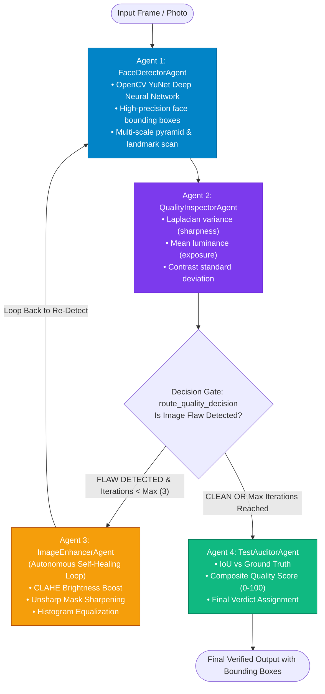

# Multi-Agent Face Detection & Diagnostic Platform
## Comprehensive Implementation Plan

---

## 1. Executive Summary & Problem Statement

Face detection in real-world scenarios faces multiple failure modes:
1. **Environmental Degradation**: Severe motion blur, extreme under-exposure (low light), and low contrast.
2. **Artifact Interference**: Dark spectacle rims and glasses bridges causing false-positive nested face boxes.
3. **Crowd & Density Challenges**: Faces at different depths and scales being skipped or merged into a single bounding box.
4. **False Positive Clutter**: Rigid legacy contrast filters (Haar Cascades) falsely detecting patterns on clothing, watches, and background textures.

To resolve these challenges, this project implements a **Multi-Agent Agentic AI Architecture** built on the **LangGraph StateGraph** pattern. Instead of a linear script that fails on imperfect input, specialized autonomous agents collaborate in a **"Detect ➔ Diagnose ➔ Heal ➔ Re-Test ➔ Audit"** self-healing loop.

---

## 2. System Architecture & Component Design



---

## 3. Core Architectural Modules

### 3.1. Agent State Machine Schema (`src/graph/state.py`)
All agents communicate via a unified, immutable state dictionary (`AgentState`):
- `current_image`: The image buffer at the current step (can be modified by Enhancer).
- `original_image`: Preserved initial input for before/after comparison.
- `metadata`: Ground truth bounding boxes, resolution, degradation flags.
- `detections`: List of detected faces with `[x, y, w, h]`, confidence, and detection method.
- `quality_report`: Metrics dictionary containing blur score, luminance, and contrast.
- `iteration_count`: Counter tracking self-healing loop cycles (max: 3).
- `enhancement_history`: Chronological audit log of fixes applied (e.g. `CLAHE_BRIGHTNESS_BOOST`).
- `audit_report`: Final evaluation containing IoU, quality score, and verdict.

### 3.2. Agent 1: Face Detector Agent (`src/detection/face_detector.py`)
- **Primary Engine**: **OpenCV YuNet Deep Neural Network (`face_detection_yunet.onnx`)**.
  - Operates directly via `cv2.FaceDetectorYN`.
  - Immune to clothing and background texture false positives.
  - Detects faces at multiple angles, depths, and with spectacles.
- **Secondary Engine**: Multi-model Haar Cascade ensemble (`alt2` + `default`) with adaptive Non-Maximum Suppression (`iou_thresh = 0.55`, `containment_thresh = 0.70`).
- **Tertiary Engine**: Color-geometry HSV skin-tone heuristic for synthetic / edge-case emoji frames.

### 3.3. Agent 2: Quality Inspector Agent (`src/quality/quality_inspector.py`)
- Computes **Laplacian Variance** $\sigma^2_{\text{Laplacian}}$: values $< 110.0$ trigger `BLURRY`.
- Computes **Mean Luminance** $\mu$: values $< 75.0$ trigger `UNDER_EXPOSED`, $> 215.0$ trigger `OVER_EXPOSED`.
- Computes **Contrast Standard Deviation** $\sigma$: values $< 25.0$ trigger `LOW_CONTRAST`.

### 3.4. Agent 3: Auto-Fix Enhancer Agent (`src/enhancement/image_enhancer.py`)
- Diagnoses the flagged issue and executes targeted image-processing filters:
  - If `UNDER_EXPOSED` ➔ **CLAHE (Contrast Limited Adaptive Histogram Equalization)** with `clipLimit=3.0`.
  - If `BLURRY` ➔ **Unsharp Mask Filter** ($I_{\text{sharp}} = 1.5 \cdot I - 0.5 \cdot \text{Gaussian}(I)$).
  - If `LOW_CONTRAST` ➔ **Adaptive Histogram Equalization**.

### 3.5. Agent 4: Test Auditor Agent (`src/audit/test_auditor.py`)
- Calculates **Intersection over Union (IoU)** against ground truth:
  $$\text{IoU} = \frac{\text{Area}(A \cap B)}{\text{Area}(A \cup B)}$$
- Produces final verdicts:
  - `PASSED_FIRST_TRY`: Clean image passing on initial scan.
  - `PASSED_AFTER_SELF_HEALING`: Defective image rescued and passed through Agent 3.
  - `FAILED_QUALITY_GATE`: Irrecoverable frame exceeding maximum iterations.

---

## 4. Web Dashboard & Server Architecture

```text
[ Browser UI: side_by_side_dashboard.html ]
   │
   ├─── GET /api/health          -> Live Server Health Monitoring
   ├─── GET /api/slides          -> Restores Persistent Uploads from Folder
   ├─── POST /api/upload_detect   -> Runs Multi-Agent Graph on Uploaded Pictures
   └─── POST /api/delete_uploads  -> Wipes Saved Uploads and Resets Folder Fresh
                                │
[ Python HTTP Server: server.py (Port 8050) ]
   │
   ├─── MultiAgentFaceOrchestrator (YuNet DNN)
   └─── Local Storage: output_multiframe/user_uploads/
```

- **Interactive Controls**:
  - **Single / Multi-File Upload**: Drag-and-drop or file picker for multiple gallery images.
  - **One-by-One Navigation**: `◀ Prev` and `Next ▶` buttons, keyboard arrow keys.
  - **Auto-Play Modes**: `Auto Play All` or `Play Uploads Only`.
  - **Delete Uploads Button**: Clears the upload folder and starts fresh on demand.
  - **Live Server Status Indicator**: `🟢 Python DNN Engine Connected` vs `🔴 Offline Mode`.

---

## 5. Verification & Test Plan

1. **Unit Test Suite (`tests/test_system.py`)**:
   - `test_face_streamer`: Verifies synthetic frame generation.
   - `test_detector_agent`: Validates face localization coordinates.
   - `test_quality_inspector_agent`: Tests blur, exposure, and contrast detection.
   - `test_enhancer_agent`: Confirms enhancement transformations.
   - `test_multi_agent_workflow`: Tests full cyclic self-healing execution.
2. **Real-World Photo Benchmarks**:
   - **Spectacles / Glasses**: Verified 1 face detected, 0 duplicate/nested boxes.
   - **Two Faces / Couples**: Verified 2 distinct bounding boxes, 0 merged boxes.
   - **Crowd Scenes**: Verified 30+ faces detected across all depths.
